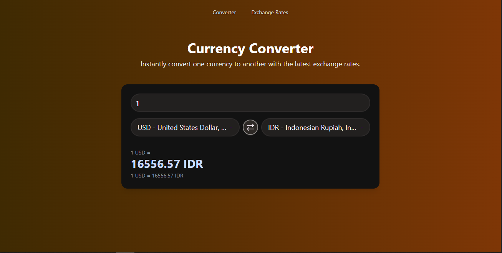
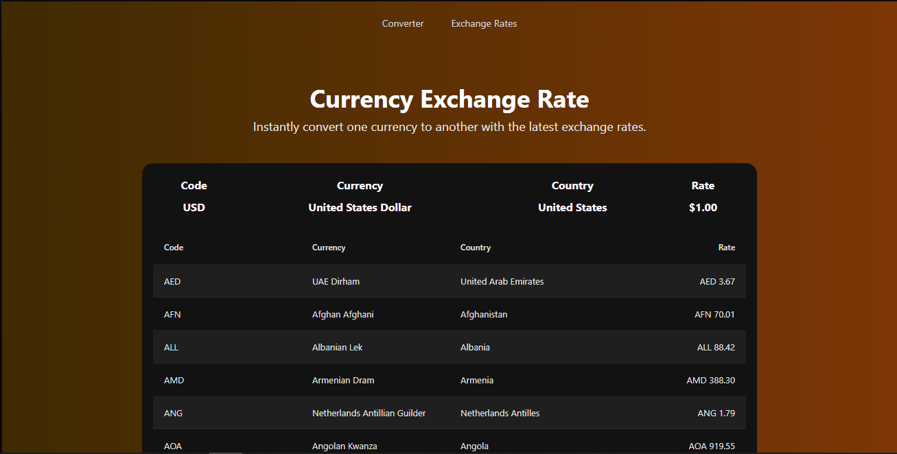

# 💱 Currency Exchange Rate Viewer

A React-based application that displays foreign exchange rates in an interactive table format using `react-data-table-component`. The app supports both static data from a local file and live data from the [exchangerate-api.com](https://www.exchangerate-api.com) API



---

## 🌐 Live Demo

Example: [View Demo](https://put-exchangerate.netlify.app)

---

## 📌 Features

- 🌍 Displays exchange rates for 150+ global currencies
- 📊 Interactive data table: sortable, paginated, and responsive
- 💵 Static row for USD always stays at the top
- 🔄 Supports live data via a personal API key from exchangerate-api.com
- 📁 Defaults to local JSON file (`src/json/response.json`) if no API is used
- 🎨 Clean and responsive UI powered by Tailwind CSS

---

## 🚀 Installation & Running the App

### 1. Clone the Repository

```bash
git clone https://github.com/hmzahiqball/exchange-app.git
cd exchange-app
```

### 2. Install Dependencies
```bash
npm install
```

### 3. Start the Development Server
```bash
npm run dev
```


## 🔧 Using Live API (Optional)
To display real-time exchange rates, you can use your personal API key from:

🔗 https://www.exchangerate-api.com

### Steps:
- Sign up and get your personal API key.
- Open `src/api/currencyAPI.jsx` and update the token with your API key


## 🗂 Project Structure
```bash
├── public/
├── src/
│   ├── data/
│   │   └── currencyMeta.js        # Currency names and country metadata
│   ├── json/
│   │   └── response.json          # Local exchange rate data (default)
│   └── components/
│       └── CurrencyTable.jsx      # Main data table component
├── .env                           # API key configuration file (optional)
├── package.json
└── README.md
```